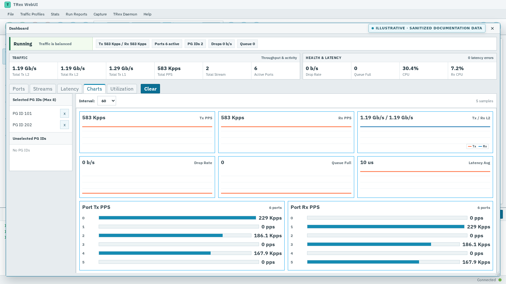
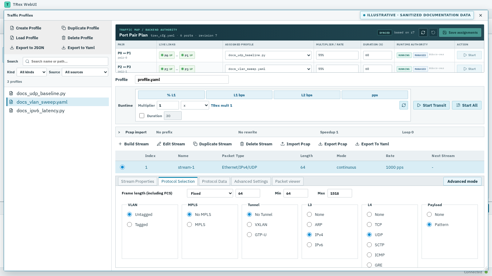
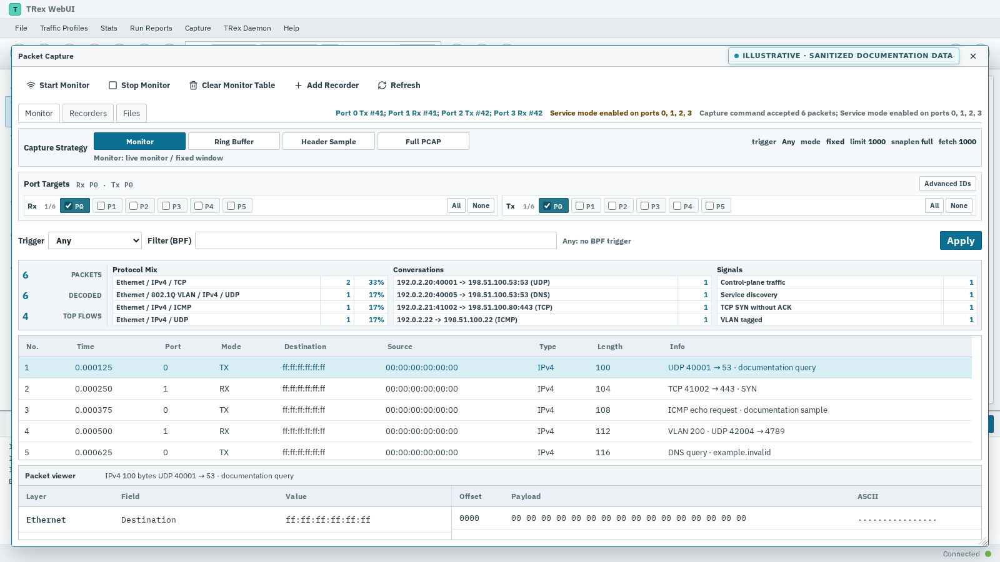
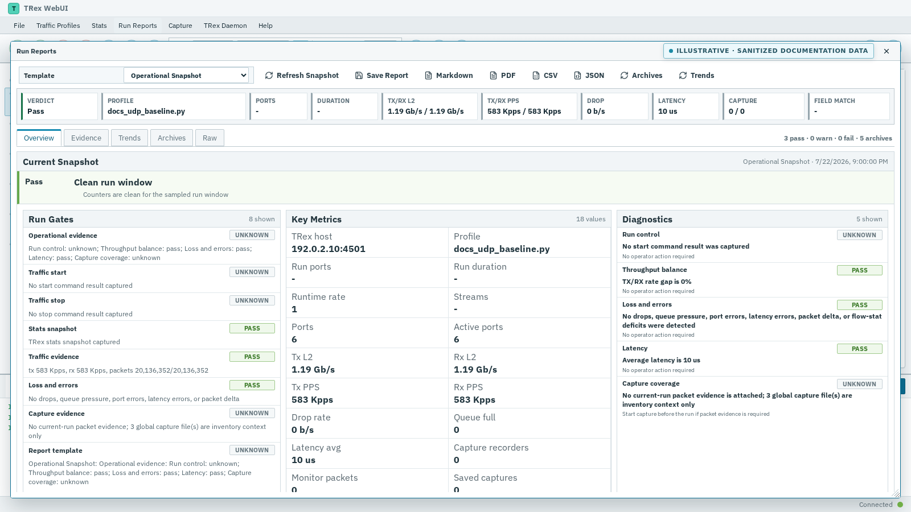

# TRex WebUI

[](https://github.com/lenxy-ea/trex-webui/actions/workflows/ci.yml)
[](CHANGELOG.md)
[](LICENSE)

**A desktop-grade control plane for real Cisco TRex STL labs.**

Build traffic, operate multi-port runs, inspect live statistics and captures,
manage the TRex runtime, and preserve auditable run evidence from one dense
browser workspace.

> [!NOTE]
> TRex WebUI is an independent, unofficial project. It is not affiliated with,
> sponsored by, or endorsed by Cisco. The project is currently a release
> candidate for one trusted operator on a management network.

[](docs/images/hero-dashboard.png)

<p align="center"><sub>Six-port dashboard with live throughput, health, latency, and per-port trends.</sub></p>

## One workflow, from profile to proof

| | |
| --- | --- |
| **Operate real traffic**<br>Discover and control ports, keep a persistent three-pair traffic plan, and start, update, pause, resume, or stop supported sessions. | **See the whole run**<br>Inspect global, port, stream, latency, utilization, loss, and health data through live backend events. |
| **Build profiles and packets**<br>Browse profiles, edit streams, import/export PCAP, use structured protocol editors, or drop into raw packet and Field Engine controls. | **Capture and decode**<br>Monitor or record selected ports, apply BPF and capture budgets, inspect decoded packets, and download PCAP evidence. |
| **Validate a saved pair**<br>Use Guided Quick Validation for an explicitly authorized 1–60 second run with link, idle, packet, loss, and cleanup proof. | **Preserve evidence**<br>Review gates, diagnostics, trends, archive comparisons, and raw data; export Markdown, PDF, CSV, or JSON reports. |
| **Own the runtime safely**<br>Preview TRex YAML, manage config versions, inspect audit/log output, and use a persistent supervisor with guarded mutations. | **Release what you tested**<br>Bind exact-source hardware reports to an attested archive, then install through a fail-closed verified-upgrade entrypoint. |

Hardware, RPC, permission, configuration, and link failures remain visible
blockers. The product path does not replace an unavailable TRex environment
with mock traffic or a fake healthy state.

## Visual tour

The screenshots below use sanitized illustrative data rendered by the real
production UI. They demonstrate workflows, not hardware certification; release
evidence is produced separately by the real-hardware acceptance gate.

### Profile and Stream Builder

[](docs/images/profile-builder.png)

Compose streams in structured or expert views, configure protocol fields, and
move between profile runtime settings, PCAP workflows, and packet inspection.

### Packet Capture

[](docs/images/packet-capture.png)

See protocol mix and conversations beside retained packets and decoded fields,
with monitor, recorder, filter, budget, and PCAP workflows in the same surface.

### Run Reports

[](docs/images/run-reports.png)

Turn a run into an operator-readable verdict with gates, metrics, diagnostics,
history, comparisons, and downloadable evidence.

Regenerate all four images from a running current UI with:

```bash
scripts/npmw run screenshot:readme -- --url http://127.0.0.1:5176
```

The capture command blocks API calls outside its sanitized fixture contract and
marks every output as illustrative documentation data. If Chromium is not
already in the Playwright cache, install it with
`scripts/npmw --prefix apps/web exec -- playwright install chromium`.

## Current scope

The current package version is **v0.1.0-rc.2**. Milestone names describe
product scope, not blanket release certification.

| Area | Current boundary |
| --- | --- |
| Operator model | One trusted operator; no built-in authentication, tenancy, or RBAC |
| Browser | Current desktop Chromium-family browser |
| Validated host | AlmaLinux 9.8, x86_64 |
| Validated TRex | v3.08 stateless/STL control plane |
| Reference topology | Six Intel i350 ports arranged as three logical pairs |
| Deployment | Same-host managed daemon behind Nginx, or an explicitly operator-managed external supervisor |
| Product status | M0 and the six-port control loop are implemented; replacement, compatibility, and broader evidence milestones remain partially verified |

The six-port baseline validates configuration, inventory, control, runtime
state, and cleanup paths. Real traffic and capture certification is always
bound to the selected port pair, its current link state, the active
configuration, the exact source identity, and the evidence archive generated
by that run.

Public-Internet or untrusted-LAN exposure, shared multi-user operation,
mobile/tablet layouts, ASTF workflows, and containers/Kubernetes in
managed-local mode are not supported. Other operating systems, NICs, and TRex
versions have narrower best-effort or unverified status.

See the [support matrix](docs/SUPPORT_MATRIX.md) and
[project roadmap](docs/PROJECT_ROADMAP.md) for the exact boundary.

## Architecture

```text
Desktop browser
      │
      │ HTTP + SSE
      ▼
Nginx management-network allowlist
      ├── serves the React/Vite application
      └── proxies /api to loopback
                   │
                   ▼
             FastAPI backend
                   ├── project-owned API and runtime authority
                   ├── reports, captures, and guarded config workflows
                   └── TRex adapter layer
                              │
                              ▼
                 STLClient / daemon / Scapy / JSON-RPC
                              │
                              ▼
                       Real TRex hardware
```

TRex transport stays behind backend adapters. The browser consumes
project-owned contracts and never talks directly to STL, Scapy, or daemon
ports. In the supported same-host deployment, the unprivileged API and the
root-owned persistent TRex supervisor are separate services.

## Production quick start

Production uses an attested, prebuilt release archive. The target host does not
need Node.js or npm, and API/Nginx always consume the same content-addressed
`current` release selector.

```bash
TAG="v0.1.0-rc.2" # choose the published release
VERSION="${TAG#v}"
RELEASE_DIR="$(mktemp -d -t trex-webui-release.XXXXXXXX)"

gh release download "$TAG" --repo lenxy-ea/trex-webui --dir "$RELEASE_DIR"
export GH_TOKEN="$(gh auth token)"

sudo --preserve-env=GH_TOKEN \
  bash "$RELEASE_DIR/trex-webui-${VERSION}.verified-upgrade.sh" \
  --tag "$TAG" \
  --metadata "$RELEASE_DIR/trex-webui-${VERSION}.release.json" \
  -- --install-nginx --install-python-deps --verify
```

The downloaded bootstrap is invoked through `bash` because GitHub release
downloads do not preserve its executable bit. Before adding real hardware and
LAN access, prepare a reviewed TRex YAML and a narrow management CIDR; the
[installation guide](docs/INSTALLATION.md) provides the complete copy-safe
command, read-only doctor, secure defaults, structured results, upgrade,
verification, and rollback workflow.

After installation, one high-level entrypoint covers routine operations:

```bash
sudo /opt/trex-webui/current/deploy/trex-webui status
sudo /opt/trex-webui/current/deploy/trex-webui doctor --operation upgrade
sudo /opt/trex-webui/current/deploy/trex-webui verify --trex
```

## Development quick start

### Prerequisites

- A supported Linux/x86_64 host; see
  [docs/SUPPORT_MATRIX.md](docs/SUPPORT_MATRIX.md).
- Python 3.11.
- Node.js 24.16.0 and npm 11.x. The bootstrap can install the pinned,
  project-local runtime on supported Linux/x64 hosts.
- An operator-installed upstream TRex distribution for hardware workflows.
- A current desktop Chromium-family browser.

### Install development dependencies

```bash
git clone https://github.com/lenxy-ea/trex-webui.git
cd trex-webui

scripts/bootstrap_node.sh
scripts/npmw ci
scripts/npmw --prefix apps/web ci

python3.11 -m venv .venv
.venv/bin/python -m pip install --require-hashes --only-binary=:all: \
  -r apps/api/requirements-dev.lock

cp .env.example .env
```

`scripts/npmw` prefers the pinned runtime under `.tools/` and also accepts a
compatible Node 24/npm 11 installation already on `PATH`. Use `npm ci` through
the wrapper so the checked-in lockfiles remain authoritative.

The copied `.env` keeps development services and the default TRex target on
loopback. Review every path and endpoint before connecting real hardware.

### Start the development services

Backend:

```bash
.venv/bin/uvicorn app.main:app --app-dir apps/api --reload \
  --host 127.0.0.1 --port 8080
```

Frontend, in another terminal:

```bash
scripts/npmw run dev:web -- --host 127.0.0.1 --port 5176
```

Open [http://127.0.0.1:5176/](http://127.0.0.1:5176/).

Without a reachable TRex environment, the interface stays usable for
development but reports explicit hardware blockers instead of generating
plausible traffic data.

## Connect real TRex hardware

The default `.env.example` targets a local TRex installation. A remote daemon
is supported only when its lifecycle, persistence, firewall, authentication,
and logs are owned by the operator:

```dotenv
TREX_WEBUI_TREX_HOST=trex.example.test
TREX_WEBUI_DAEMON_SUPERVISOR=external
```

Restrict daemon, STL, and Scapy ports so only the WebUI host can reach them.
TRex WebUI does not add authentication to upstream TRex control protocols.

[examples/trex_cfg.yaml](examples/trex_cfg.yaml) shows the schema of a
fictional six-port Intel i350 configuration using documentation-only values.
It is not hardware-certified and must never be deployed unchanged. Follow
[examples/README.md](examples/README.md) to replace and verify every PCI
address, MAC/IP value, NUMA socket, port pair, and core assignment.

## Deployment and operations

The validated production topology is a same-host managed TRex daemon behind
Nginx on a trusted management network. A remote or independently managed daemon
must be selected explicitly with `--external-daemon`; its lifecycle, firewall,
logs, and recovery remain operator-owned.

Nginx denies non-loopback clients until a narrow allowlist is explicitly
installed. `deploy/trex-webui` accepts `--allow-cidr` and `--trex-config`,
validates both before mutation, and publishes them through the same rollback
transaction as the release. `0.0.0.0/0`, non-canonical networks, symbolic-link
configs, unsafe ownership, and broad implicit access are rejected.

- [Installation and day-two operations](docs/INSTALLATION.md) — release-first
  install, doctor, status, verify, upgrade, rollback, JSON output, and recovery.
- [Deployment internals](docs/NGINX_DEPLOYMENT.md) — systemd, nftables, SELinux,
  Nginx, archive, selector, and failure semantics.
- [Exact-tag release runbook](docs/RELEASE.md) — qualification, attestations,
  immutable assets, and verified bootstrap.

## Security boundary

> [!WARNING]
> TRex WebUI has no built-in login, tenant isolation, or RBAC. Anyone who can
> reach it may be able to mutate traffic-generator state. Do not expose the
> WebUI, API, Vite server, daemon, STL, or Scapy ports to the Internet or an
> untrusted LAN.

The supported topology keeps Nginx deny-by-default, FastAPI bound to
`127.0.0.1`, managed-local daemon RPC on loopback, and native TRex/Scapy ports
behind the installer-owned nftables boundary. Add TLS or reverse-proxy
authentication independently when required; these perimeter controls do not
turn the application into a multi-user authorization system.

Read [SECURITY.md](SECURITY.md) and the
[deployment guide](docs/NGINX_DEPLOYMENT.md) before operating real hardware.

## Validation

Safe local checks do not intentionally send traffic:

```bash
scripts/npmw test
scripts/npmw run typecheck:web
scripts/npmw run lint:web
scripts/npmw run build:web
scripts/tests/public_source_test.sh
.venv/bin/python -m pip_audit -r apps/api/requirements-dev.lock
scripts/npmw --prefix apps/web audit --audit-level=high
```

Hardware integration tests are always explicit:

```bash
TREX_WEBUI_RUN_HARDWARE_TESTS=1 \
  .venv/bin/python -m pytest apps/api/tests/integration
```

Traffic and capture smoke tests have separate opt-ins because they mutate real
ports. See [docs/DEVELOPMENT.md](docs/DEVELOPMENT.md) for those commands and
their cleanup contract.

Major TRex WebUI changes require a real-hardware Standard E2E with a
host-validated configuration:

```bash
scripts/npmw run verify:major -- --base-url http://127.0.0.1 \
  --config-file /path/to/validated/trex_cfg.yaml
```

On a cabled six-port qualification host whose saved plan maps
`0↔1`, `2↔3`, and `4↔5`, additionally run:

```bash
scripts/npmw run e2e:six-port -- --base-url http://127.0.0.1
```

That gate requires per-port TX/RX movement on all six links and saves a report
bound by the backend's exact traffic-session revision; it is not a simulated or
portable no-hardware test.

The optional browser write acceptance performs real control-plane writes and
must be requested separately:

```bash
scripts/npmw run verify:major -- --base-url http://127.0.0.1 \
  --config-file /path/to/validated/trex_cfg.yaml \
  --browser-write-acceptance
```

Never point either command at the unedited public example. A passing gate binds
the current source, frontend assets, API identity, active configuration,
observed hardware, and clean postconditions into a
fresh local/server report pair. A hardware, link, RPC, permission, or
configuration failure remains a blocker; an illustrative fixture cannot waive
this gate.

### Guided Quick Validation

Open **Tests → Quick Validation** for a short, operator-guided check of one
saved traffic-plan group. The workspace requires explicit real-hardware
authorization and a 1–60 second duration. Before traffic starts, the backend
requires the selected ports to be physically **UP**, report **IDLE**, be
stopped and unowned, and still match the exact saved plan revision. The result
retains the configuration, profile digest, canonical traffic IDs, per-port
packet/loss samples, stop evidence, WAL cleanup, acquisition restoration, and
final idle proof.

Keep the workspace open until the normal deadline: v1 advances normal sampling
and stop work through status polling. Closing the window does not silently
cancel traffic; the persisted backend hard-stop lease remains authoritative.
An API restart, missed normal deadline, watchdog stop, stale session, missing
traffic, packet deficit, or incomplete cleanup produces a conservative failure
rather than a passing result.

## Repository map

```text
apps/api    FastAPI backend and TRex control-plane adapters
apps/web    React/Vite desktop operator console
deploy      Nginx, systemd, packaging, upgrade, and verification tooling
docs        Architecture, development, deployment, support, and roadmap notes
examples    Fictional, non-production configuration examples
profiles    Project traffic-profile catalog
scripts     Toolchain wrappers and real-hardware acceptance workflows
```

## Contributing and support

TRex WebUI is community-maintained and pre-release. Contributions that preserve
the real-hardware, fail-closed, single-operator design are welcome.

- [CONTRIBUTING.md](CONTRIBUTING.md) — development and pull-request workflow
- [SECURITY.md](SECURITY.md) — private vulnerability reporting
- [CODE_OF_CONDUCT.md](CODE_OF_CONDUCT.md) — community standards
- [SUPPORT.md](SUPPORT.md) — support scope and reporting checklist
- [docs/SUPPORT_MATRIX.md](docs/SUPPORT_MATRIX.md) — validated platform matrix
- [docs/PROJECT_ROADMAP.md](docs/PROJECT_ROADMAP.md) — implementation and acceptance roadmap
- [docs/PROVENANCE.md](docs/PROVENANCE.md) — upstream and third-party provenance
- [CHANGELOG.md](CHANGELOG.md) — release history

When reporting a problem, remove credentials, private addresses, MAC addresses,
PCI identifiers, packet payloads, reports, and other lab-specific data.

## License

TRex WebUI is available under the [Apache License 2.0](LICENSE). Attribution
and third-party terms are recorded in [NOTICE](NOTICE),
[THIRD_PARTY_NOTICES.md](THIRD_PARTY_NOTICES.md), and
[docs/PROVENANCE.md](docs/PROVENANCE.md).
